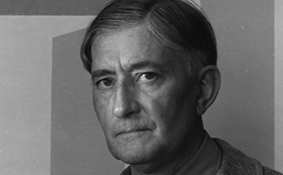
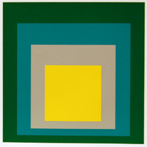
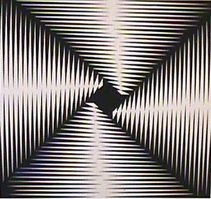
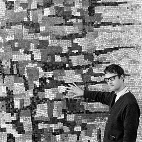
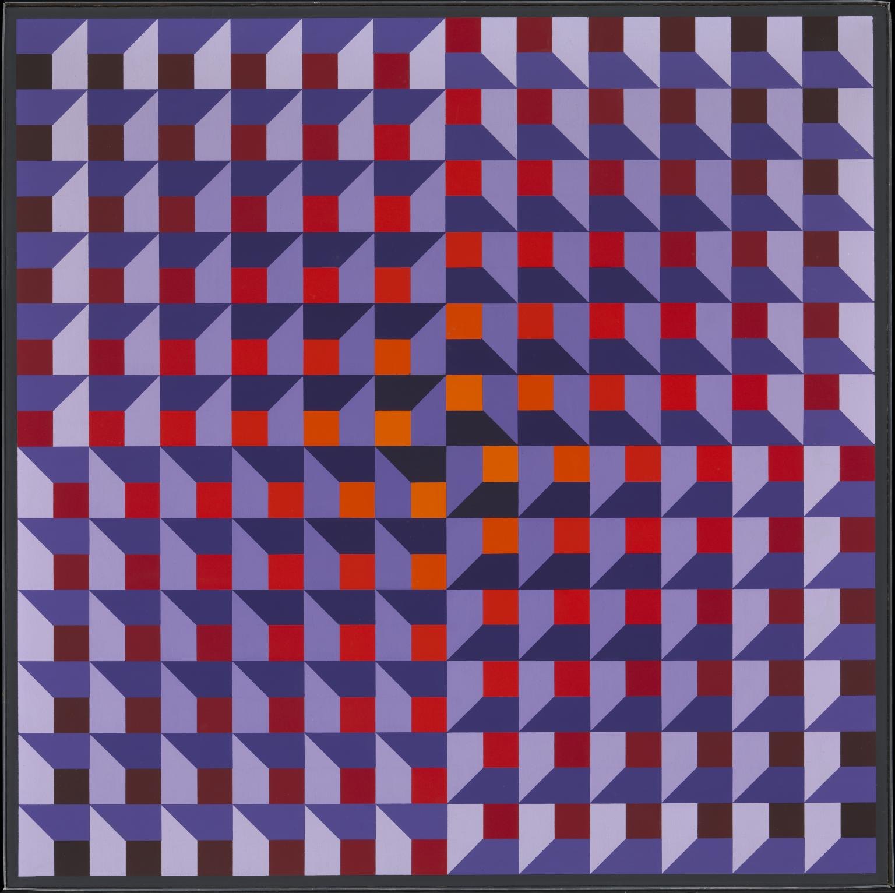

I think Op art is a form of abstract art that gives a illusions of movement in art.
Or Op art can be diffrent patterns that can fool people to see movement.

[Op Art- What Is That?]https://www.tate.org.uk/kids/explore/what-is/op-art

I picked this as 1 of my resources because it shows some pictures of Op art and it explains what is Op art

[Op Art Gallery]http://www.op-art.co.uk/op-art-gallery/

I picked this as my second resource because it shows you images and examples of Op art and it helps me visualize Op art

[Techniques For Op Art]https://www.slideshare.net/bthemuck/techniques-op-art

This is my third resource because it shows me examples and how to make Op art step-by-step

[5 Famous Op-Artist - Optical Illusions Art]https://948783666602171788.weebly.com/5-famous-op-artists.html

This is my fourth resource because it gives you examples of op artist and their storys

## Three Op artis 

### 1) Josef Albers
Born: March 19, 1888, Bottrop, Germany

Died: March 25, 1976, New Haven, CT

From: Bottrop, Germany

I think his art is pretty basic because it's a couple of squars in more squares but nice colors.

### 2) Richard Allen
Born: February 8, 1933, Worcester, United Kingdom

Died: February 9, 1999, London, United Kingdom

From: Worcester, UK

I like his art because its more complex and it kinda moves which i think is cool

### 3) Jean- Pierre Yvaral
Born: January 25, 1934, Paris, France

Died: August 2, 2002, Paris, France

From: Paris, France

His art is cool because it is 3D and the insperation people got from him made other cool arts i like

